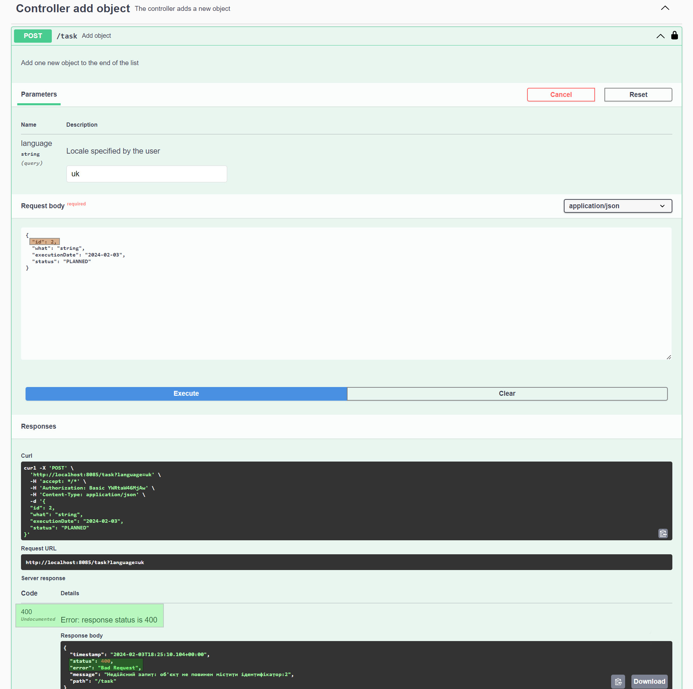
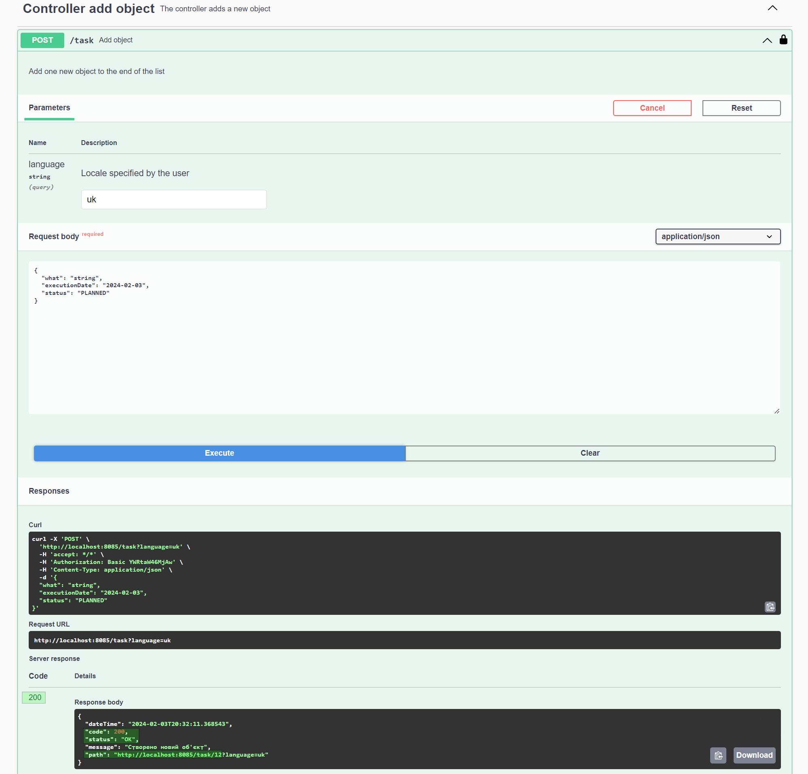

<h1>Java-CRUD REST API</h1>

<h2>Description of the Application</h2>

This application is a Java CRUD REST API demonstration program written using the Spring Boot framework.

The program's logic works with a list of TODO tasks, which are recorded in an H2 in-memory database 
during program execution. Data storage is managed by creating and populating a table using scripts located 
in the "resources/database" folder. The allowed status values for TODO tasks are described 
in the "TaskStatus.enum" object in the "model" package.

The application runs on port 8085 (as specified in the "application.properties" file).

For this application, auto-documentation for Swagger has been implemented, and it can be accessed 
at the following URL: http://localhost:8085/swagger-ui/index.html#

Authentication of the Basic type has been implemented, with two users having different access levels to 
endpoints: admin (GET, POST, PUT, DELETE) and user (GET, PUT). 
Login information: (username: admin, password: 200); (username: user, password: 100)

Logging is configured (in the "logback.xml" settings file) with both console output and file recording.

Data validation has also been implemented for user input.

Internationalization of messages is configured, and the application supports the following 
language codes: de, en, fr, it, uk. You can specify the language by adding it to the URL in the browser's 
address bar after the URL, e.g., ?language=en.

Additionally, controller and service class methods are covered by unit tests using mock objects. 
Significant attention was given to testing the status changes of tasks since each status has a list of valid values. 
Exception testing for incorrect status changes has also been implemented.

<h2>Technologies Used</h2>

<ul>
<li>Java</li>
<li>Maven</li>
<li>Spring</li>
<li>H2-DB</li>
<li>Swagger</li>
<li>JUnit</li>
<li>Mockito</li>
</ul>

<h2>Screenshots of the application console</h2>

 
 
 
 

